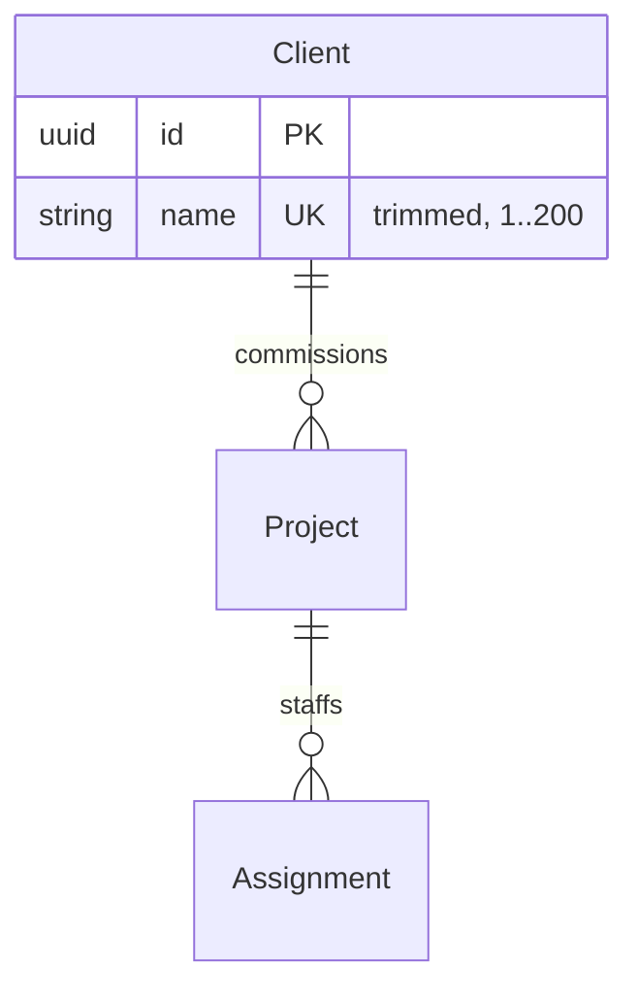

# Domain Model Diagram

You produce **one file**: `docs/domain.md`. It is a derived view — the specs remain the
authority. Never invent an entity, attribute or relationship that no spec states, and never
edit a spec from this skill. If the specs contradict each other, render what the diagram can
and record the conflict in the *Conflicts and open questions* section rather than picking a winner.

## 1. Gather

1. `Glob docs/specs/*.md` to get every spec, in number order.
2. Read each spec's **§5 Domain Model** in full — subsections `5.1 Entities`,
   `5.2 Relationships`, `5.3 Value Objects`, `5.4 Domain Rules and Invariants`.
   Read §1 (Problem/Goal) only if an entity's purpose is unclear from §5.
3. Note the exact heading anchors you will link to, and each entity's `#### <Name>` heading.

Specs use these conventions — rely on them:

- An entity is a `####` heading under `### 5.1 Entities` followed by an attribute table with
  columns *Attribute | Type | Constraints | Description*.
- A heading like `#### Project, Person — *referenced, not defined here*` means those entities
  are **owned by another spec**. Do not re-declare their attributes; the owning spec wins.
- Constraints carry the keys: `PK`, `FK → Other`, `unique`, `unique together: (a, b)`, `required`.
- A later spec may **amend** an earlier one (look for "Amendment to spec NNN" blockquotes).
  The amendment wins; keep a note of it for the *Amendments* section.

## 2. Reconcile

Build one merged model before drawing anything:

- **One node per concept.** If two specs define the same entity, merge the attribute sets and
  apply any amendment. Attribute the entity to the spec that *defines* it (the earliest one that
  gives it a table), and list amending specs alongside.
- **Resolve relationship cardinality** from the prose in §5.2 — "has many", "belongs to exactly
  one", "may exist with no", "links one X, one week and one Y". If prose and a `FK →` constraint
  disagree, prefer the prose and flag it.
- **Derived data is not an attribute.** Burned/remaining hours are aggregated, never stored
  ([ADR-0002](../architecture/adr/0002-burned-hours-derived-never-stored.md)) — leave them out of
  the node and mention them in the entity's notes line instead.
- **Value objects** are separate nodes, marked as such, linked to the entities that hold them.

## 3. Draw

One `erDiagram` for the whole domain — not one per spec. Group the layout by spec order so the
oldest, most central entities appear first.

Rules for valid, readable Mermaid:

- Entity names in `PascalCase`, no spaces, no hyphens.
- Attribute lines are `type name KEY "comment"`. Types must be **one word** — use `uuid`, `string`,
  `int`, `decimal`, `date`, `datetime`, `bool`, `enum`, or the value-object name (`Duration`).
- Keys: `PK`, `FK`, `UK`. Use `UK` for single-column uniqueness; put composite uniqueness in the
  *Invariants* list below the diagram, not in the node.
- Include every attribute the spec tables list, in the spec's order. Do not trim for brevity.
- Cardinality: `||--o{` one-to-many-optional, `||--|{` one-to-many-required, `}o--||`, `||--||`
  one-to-one. Every relationship gets a verb label read left-to-right: `Client ||--o{ Project : "has"`.
- Mark value objects with a trailing comment attribute line and keep them at the bottom of the diagram.

Shape to follow:

````markdown

````

## 4. Write `docs/domain.md`

Always this structure, in this order:

1. `# Domain Model` + a one-line statement that the file is generated from `docs/specs/` and is
   regenerated by `/domain-model`.
2. **Entity index** — a table: *Entity | Kind (Entity / Value object) | Defined in | Purpose*, where
   *Defined in* is a markdown link into the owning spec, e.g.
   `[spec 005 §5.1](specs/005-weekly-time-grid.md#51-entities)`. This is the "links" half of the file:
   every node in the diagram must appear here with a working link, and vice versa.
3. **Diagram** — the single `erDiagram` block.
4. **Relationships** — bullet list restating each edge in domain language, each with the spec
   reference that states it.
5. **Invariants** — cross-entity rules and composite uniqueness, each tagged with its spec and rule
   ID (`FR-006`, `SC-010`) so a reader can trace it.
6. **Amendments** — later specs that changed earlier ones, newest first. One line each: what changed,
   which spec superseded which.
7. **Conflicts and open questions** — anything unreconcilable, or `_None._`

Keep entity names exactly as the specs spell them; this file is part of the ubiquitous language.

## 5. Updating an existing file

If `docs/domain.md` exists, **read it first**, then rewrite it from the specs — do not patch edits
into a stale diagram. Preserve any hand-written prose that sits under a heading not in the structure
above (someone added it deliberately); move it to the end under its original heading and say so.

Then report to the user, concisely:

- entities added, removed, or changed since the previous version (diff the entity index),
- any new amendment or conflict,
- the file path.

If nothing changed, say so and leave the file untouched.

## 6. Verify before finishing

- Every `####` entity in every spec §5.1 appears in the diagram **and** the index — walk the specs
  once more and tick them off.
- Every `FK →` in every attribute table has a matching edge in the diagram.
- No node is orphaned unless the spec genuinely defines it standalone.
- The Mermaid block parses: balanced braces, one-word types, quoted multi-word labels, no stray
  Markdown inside the fence.
- Every link in the entity index points at a file that exists and an anchor that exists in it.
