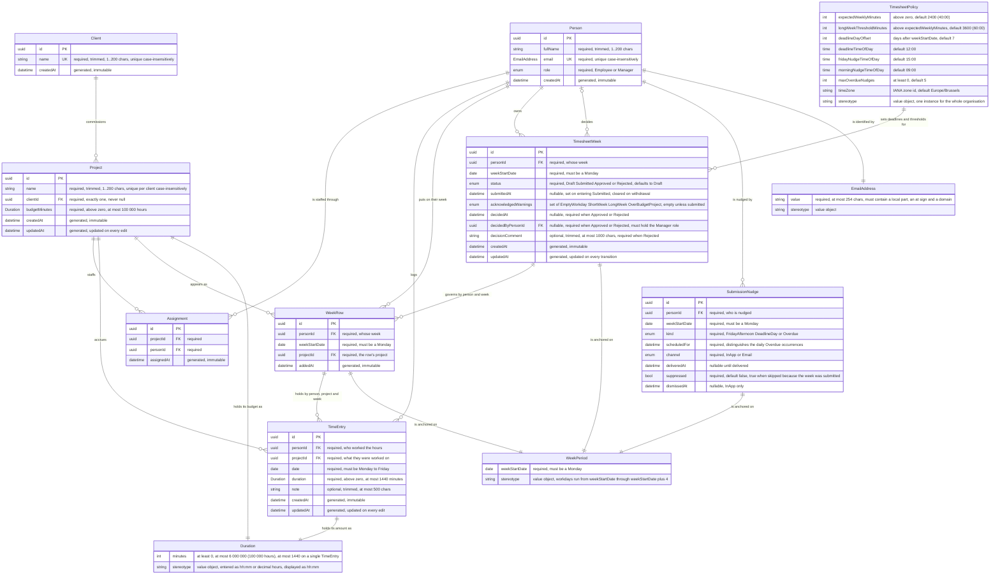

# Domain Model

Generated from the specs in [`docs/specs/`](specs/), which remain the authority; regenerate with `/domain-model`.

## Entity index

| Entity | Kind | Defined in | Purpose |
| --- | --- | --- | --- |
| Client | Entity | [spec 001 §5.1](specs/001-project-setup.md#51-entities) | An organisation work is done for; projects are grouped under it. |
| Person | Entity | [spec 001 §5.1](specs/001-project-setup.md#51-entities) | Someone who can be assigned to projects, log hours, own a week, and — as a Manager — decide one. A record only; it carries no credentials. |
| Project | Entity | [spec 001 §5.1](specs/001-project-setup.md#51-entities) — amended by [spec 005 §5.3](specs/005-weekly-time-grid.md#53-value-objects) | A funded container for work. Every logged hour belongs to exactly one. Burned and remaining hours are derived, never stored ([ADR-0002](architecture/adr/0002-burned-hours-derived-never-stored.md)). |
| Assignment | Entity | [spec 001 §5.1](specs/001-project-setup.md#51-entities) | The manager's decision that a person may log hours against a project. A pure link with a stamp. |
| TimeEntry | Entity | [spec 005 §5.1](specs/005-weekly-time-grid.md#51-entities) | Hours worked by one person, on one project, on one day, with an optional note. Referenced but not defined by [spec 001 §5.1](specs/001-project-setup.md#51-entities). |
| WeekRow | Entity | [spec 005 §5.1](specs/005-weekly-time-grid.md#51-entities) | The employee's decision that a project belongs on their week; stored because an unfilled row has no entries to derive it from. |
| TimesheetWeek | Entity | [spec 010 §5.1](specs/010-submit-week.md#51-entities) | One employee's week and the state it is in: Draft, Submitted, Approved or Rejected. Absence of a record means Draft. |
| SubmissionNudge | Entity | [spec 010 §5.1](specs/010-submit-week.md#51-entities) | One scheduled reminder occurrence for one person and one week; stored so a delivery is never repeated. |
| EmailAddress | Value object | [spec 001 §5.3](specs/001-project-setup.md#53-value-objects) | A person's email, compared case-insensitively for uniqueness and stored as entered for display. |
| Duration | Value object | [spec 001 §5.3](specs/001-project-setup.md#53-value-objects) — amended by [spec 005 §5.3](specs/005-weekly-time-grid.md#53-value-objects) | A quantity of time held as whole minutes, used for both budgets and logged amounts ([ADR-0003](architecture/adr/0003-durations-as-whole-minutes.md)). |
| WeekPeriod | Value object | [spec 010 §5.3](specs/010-submit-week.md#53-value-objects) | A working week identified by its Monday; its workdays are that Monday through Monday + 4. |
| TimesheetPolicy | Value object | [spec 010 §5.3](specs/010-submit-week.md#53-value-objects) | The organisation's single set of timesheet expectations — deadline, nudge moments, thresholds, time zone. Configuration, not user-editable data. |

## Diagram

## Relationships

- A **Client** has many **Projects**, including none — a client with no projects is valid ([spec 001 §5.2](specs/001-project-setup.md#52-relationships), EC-11).
- A **Project** belongs to exactly one **Client**, never zero ([spec 001 §5.2](specs/001-project-setup.md#52-relationships), FR-006).
- A **Project** relates to many **People** through **Assignment**, and a **Person** may be assigned to many **Projects**, including none ([spec 001 §5.2](specs/001-project-setup.md#52-relationships)).
- A **Person** has many **TimeEntries**; each **TimeEntry** belongs to exactly one Person ([spec 005 §5.2](specs/005-weekly-time-grid.md#52-relationships)).
- A **Project** has many **TimeEntries**; this is the relationship summed to derive burned hours ([spec 005 §5.2](specs/005-weekly-time-grid.md#52-relationships), [spec 001 §5.4](specs/001-project-setup.md#54-domain-rules-and-invariants)).
- A **TimeEntry** references a **Person** independently of whether that person is *currently* assigned; removing an assignment leaves the entry intact ([spec 001 §5.2](specs/001-project-setup.md#52-relationships), SC-014).
- A **WeekRow** links one **Person**, one week and one **Project** ([spec 005 §5.2](specs/005-weekly-time-grid.md#52-relationships)).
- Every **TimeEntry** has a corresponding **WeekRow** for its person, project and week — entries never exist off-grid — and a **WeekRow** may exist with no **TimeEntries** ([spec 005 §5.2](specs/005-weekly-time-grid.md#52-relationships)). The link is by matching key, not by a foreign key.
- **Assignment** governs which projects may be *added* to a week and *written to*; it does not own existing rows or entries ([spec 005 §5.2](specs/005-weekly-time-grid.md#52-relationships), SC-010).
- A **Person** has many **TimesheetWeeks**; each **TimesheetWeek** belongs to exactly one Person ([spec 010 §5.2](specs/010-submit-week.md#52-relationships)).
- A **TimesheetWeek** covers the same `(personId, weekStartDate)` as zero or more **WeekRows** and, through them, zero or more **TimeEntries**; its state applies to all of them at once ([spec 010 §5.2](specs/010-submit-week.md#52-relationships)).
- A **TimesheetWeek** may be decided by one **Person** holding the Manager role — never by its own owner ([spec 010 §5.2](specs/010-submit-week.md#52-relationships), §5.4).
- A **Person** has many **SubmissionNudges**; each nudge concerns exactly one person and one week ([spec 010 §5.2](specs/010-submit-week.md#52-relationships)).
- A **SubmissionNudge** does *not* reference a TimesheetWeek row, only its key — nudges exist precisely for weeks that may have no record yet ([spec 010 §5.2](specs/010-submit-week.md#52-relationships)).
- **TimesheetPolicy** is a single organisation-wide instance from which every week's deadline, nudge moments and thresholds are derived ([spec 010 §5.3](specs/010-submit-week.md#53-value-objects)).

## Invariants

**Uniqueness**

- `Client.name` is globally unique, compared case-insensitively on the trimmed value — spec 001 FR-002, SC-002.
- `Person.email` is globally unique, compared case-insensitively — spec 001 FR-004, SC-004.
- `Project.name` is unique **per client**, case-insensitively; two clients may each have a "Website" — spec 001 FR-007, SC-008, SC-009. The rule is evaluated against the *target* client when a project is moved (EC-15).
- `Assignment` is unique together on `(projectId, personId)` — spec 001 FR-010, SC-013, EC-9.
- `TimeEntry` is unique together on `(personId, projectId, date)`; one cell holds exactly one entry and re-saving a day updates in place — spec 005 §5.4.
- `WeekRow` is unique together on `(personId, weekStartDate, projectId)` — spec 005 FR-006, SC-006.
- `TimesheetWeek` is unique together on `(personId, weekStartDate)`; one state per person per week — spec 010 §5.4.
- `SubmissionNudge` is unique together on `(personId, weekStartDate, kind, scheduledFor, channel)` — spec 010 FR-022, NFR-004, EC-14.

**Derived, never stored**

- `burnedHours` = the sum of the durations of all **TimeEntries** for a project, across all people and regardless of week status. Computed on read; `0`, never null, for a project with no entries — spec 001 FR-014, FR-017, SC-018; spec 010 §5.4; [ADR-0002](architecture/adr/0002-burned-hours-derived-never-stored.md).
- `remainingMinutes` = `Project.budgetMinutes − burnedMinutes`. It is a *signed* minute count and may be negative; a negative value is the meaningful representation of an overrun and is never clamped — spec 001 FR-015, SC-011, EC-13; spec 005 §5.4.
- Over budget when `burned > budget`; approaching budget when `utilisation ≥ 0.90` and not yet over. The employee's row figure and the manager's list figure are one definition with two audiences — spec 001 FR-016, SC-017; spec 005 FR-018, FR-020, FR-021, SUC-08.
- `deadline` = `weekStartDate + deadlineDayOffset` at `deadlineTimeOfDay` in the policy time zone. Changing the policy moves every deadline, past and future — spec 010 §5.4, NFR-009.
- *Overdue* is derived, not a fifth status: a week is overdue when it is Draft or Rejected and its deadline has passed — spec 010 FR-028, SC-023.

**Cross-entity rules**

- A project always has a client, at creation and after every edit — spec 001 FR-006, SUC-06.
- `Project.budgetMinutes > 0` holds at creation *and* after every edit. There is deliberately **no** `budget ≥ burned` invariant — spec 001 FR-005, SC-011, SUC-06.
- Only an **assigned** person may add a project row or write hours to it, checked against the *current* assignment at the moment of writing — spec 005 FR-005, §5.4, EC-20, NFR-005.
- Unassignment freezes, it never deletes: existing rows and entries stay visible and keep counting toward burned hours — spec 001 FR-011, SC-014, EC-14; spec 005 FR-009, SC-010.
- A `TimeEntry.date` is Monday–Friday; weekend hours are unrecordable by design — spec 005 FR-004, SC-025, SUC-07.
- `TimeEntry.duration > 0`; clearing a cell deletes the entry rather than storing a zero, so a note can never outlive its hours — spec 005 FR-016, SC-018, EC-5, EC-6, SUC-07.
- For one person and one date, the sum of all entry durations is ≤ 1440 minutes. This is a property of the *day*, enforced across the whole column at save, and a day saves whole or not at all — spec 005 FR-014, SC-015, NFR-004, SUC-05.
- `weekStartDate` is always a Monday, on **WeekRow**, **TimesheetWeek** and **SubmissionNudge** alike; an entry belongs to the week whose Monday is the most recent one on or before its date — spec 005 §5.4, spec 010 §5.4.
- A week is editable only when it is *both* not in the future *and* in Draft or Rejected. Submitted and Approved weeks reject every write to their entries and rows — spec 005 FR-023; spec 010 FR-005, SC-002, SC-025, SUC-04.
- The state machine has exactly five transitions: `Draft → Submitted`, `Rejected → Submitted`, `Submitted → Draft`, `Submitted → Approved`, `Submitted → Rejected`. Every other transition is refused, and Approved is terminal — spec 010 §5.4, FR-034, SC-028, SUC-03.
- A submission changes state and nothing else: no entry, note, row or duration is created, altered or deleted by submitting, withdrawing, approving or rejecting — spec 010 §5.4, SUC-10.
- `decisionComment` is required when `status = Rejected`, trimmed before validating; optional when Approved — spec 010 FR-034, SC-029, EC-10, SUC-08.
- `decidedAt` and `decidedByPersonId` are set together with the status, the decider must hold the Manager role, and `decidedByPersonId ≠ personId` — nobody decides their own week — spec 010 §5.4, SUC-05, SUC-08.
- An empty week is not submittable (`sum of durations > 0`), and a week starting after the current week is not submittable — spec 010 FR-002, FR-003, SC-003, SC-004.
- Warnings are computed server-side from the saved entries at the moment of submission and never block; `acknowledgedWarnings` is a snapshot, cleared on withdrawal and rewritten on each resubmission — spec 010 FR-009, FR-014, FR-015, SC-013, SC-014, EC-5, NFR-008.
- Burned hours ignore week status: Draft, Submitted, Approved and Rejected hours all count against a project's budget — spec 001 FR-014; spec 010 §5.4.
- Role is not a hierarchy. A Manager may also be assigned to projects and log hours; role governs setup actions and decisions only — spec 001 §5.4, FR-018; spec 010 §5.4.
- All duration arithmetic is integer-minute arithmetic, exact by construction, from cell to budget figure — spec 001 NFR-004, SUC-03; spec 005 NFR-003, SUC-03; [ADR-0003](architecture/adr/0003-durations-as-whole-minutes.md).
- Case-insensitive comparisons use culture-invariant comparison, so uniqueness behaves identically regardless of server locale — spec 001 EC-7.

## Amendments

- **Spec 010 §5.4 amends spec 005** (2026-09-15). Spec 005 FR-005…FR-016 describe writes to a week's rows and cells without reference to any state, because none existed; each is now conditional on the week being editable. Spec 005 §5.4's placeholder — "entries carry no lifecycle in this slice" — is superseded, and spec 005 FR-023's read-only treatment of future weeks extends to Submitted and Approved weeks. `TimesheetWeek` is keyed exactly as `WeekRow` is, so no new join is introduced.
- **Spec 005 §5.3 amends spec 001** (2026-09-15). The `Hours` value object (decimal, 2 places) cannot represent `1:20`, so it is replaced by the minute-backed `Duration`, and `Project.budgetHours` becomes `Project.budgetMinutes`. A budget is still entered and displayed in hours; it is *held* in whole minutes. Spec 001 §5.1, §5.3 and NFR-004 carry the amendment inline. Rationale in [ADR-0003](architecture/adr/0003-durations-as-whole-minutes.md).

## Conflicts and open questions

- **`WeekRow` → `TimeEntry` and `TimesheetWeek` → `WeekRow` are key-matched, not foreign-keyed.** Spec 005 §5.2 states that every TimeEntry has a corresponding WeekRow, and spec 010 §5.2 that a TimesheetWeek covers the same `(personId, weekStartDate)` as its rows — but neither spec gives `TimeEntry` a `weekRowId` or `WeekRow` a `timesheetWeekId`. The diagram draws both edges because the specs assert them; no attribute table enforces either. Whether the invariant becomes a foreign key or stays a query-level rule is unstated.
- **`SubmissionNudge` deliberately has no link to `TimesheetWeek`** (spec 010 §5.2) — nudges exist for weeks that may have no record yet. This leaves `SubmissionNudge` connected to the rest of the model only through `Person` and the shared `weekStartDate` key. Intended, not an omission.
- **`Duration`'s upper bound is stated twice with different values.** Spec 001 §5.3 gives ≤ 6 000 000 minutes (100 000 hours) for budgets; spec 005 §5.3 gives ≤ 1440 explicitly scoped to "a single time entry". These are two contexts of one value object rather than a contradiction, but no spec states the rule as a single sentence, so the node carries both.
- **Spec 001 EC-3 still names a decimal rule the amendment removed.** It rejects a budget "with more than 2 decimal places", which predates the `Hours` → `Duration` change; spec 001 §5.3 as amended refuses any value that does not land on a whole minute. The intent is the same — do not silently round — but the edge case's wording was not updated with §5.1 and §5.3.
- **`TimesheetWeek.decidedByPersonId` must hold the Manager role and must differ from `personId`** (spec 010 §5.1, §5.4). Neither condition is expressible as a foreign key; both are application-level invariants against the same `Person` table.
- **Open question — expected weekly hours may move to `Person`.** Spec 010 §10 Q2 assumes an organisation-wide 40:00 in `TimesheetPolicy`; making it per-person would add an attribute to `Person` and amend spec 001 §5.1. Deferred.
- **Open question — editing and deactivating Clients and People.** Spec 001 §10 Q2 defers it entirely, so no lifecycle or active flag exists on either entity, and no delete action is offered (spec 001 EC-16).
- **Open question — a lifecycle state on `Project`.** Story 004 (close/archive) will add one; spec 001 §1.3 and spec 005 §9.1 both note its absence, so nothing currently marks a project as closed or decides whether a closed project can still be added as a week row.
